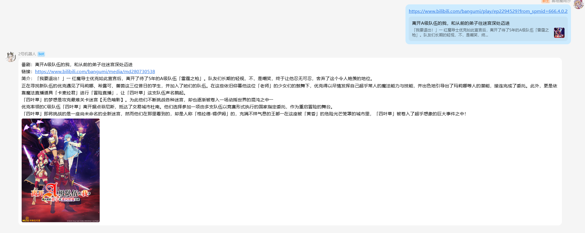
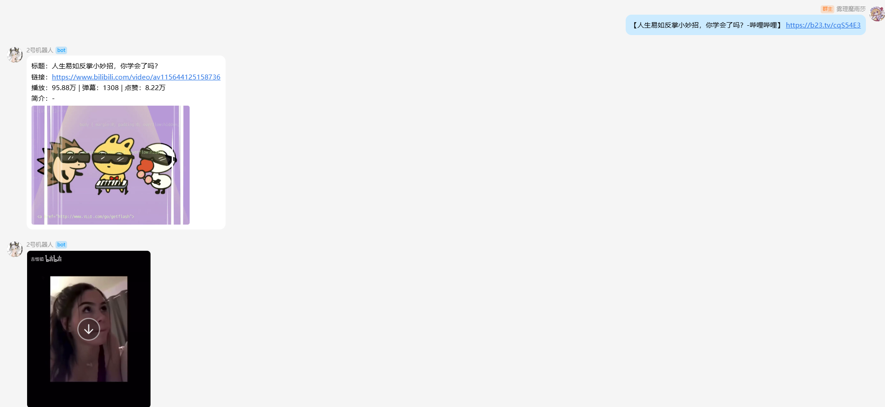

# AnalysisBilibiliPlugin 配置说明

`AnalysisBilibiliPlugin` 是一个基于 Spring Boot 3 和 Shiro 针对 B 站内容的插件，支持视频、动态、专栏和直播分析。  
插件采用 **即放即用** 机制：只需将插件 jar 放入插件目录，Bot 会自动加载，无需导入依赖或配置 Spring。

## 如何使用
下载 jar 包并放入插件扫描路径中\
详细参考文档 https://misakatat.github.io/shiro-docs/#%E5%8A%A0%E8%BD%BD%E5%A4%96%E9%83%A8%E6%8F%92%E4%BB%B6

## 注意事项
视频下载功能需要安装 `ffmpeg`，请确保 `ffmpeg` 可执行文件在系统 PATH 中。\
如果你是windows用户，你可以通过`winget`工具进行`winget install ffmpeg`来安装 `ffmpeg`。\

## 效果展示
### 视频分析

### 专栏分析

### 番剧分析

### 动态分析

### 直播间分析

### 短链识别



## 配置说明

配置文件路径：`resources/analysis.plugin.properties`

### 示例内容：
```properties
# 插件是否启用
enable=true
# B站 Cookie，用于获取需要登录的数据，比如说专栏和动态
cookie=
# 是否跳过视频信息分析总结
skipVideoAnalysis=false
# 是否在分析结果中显示图片
analysisDisplayImage=true
# 对于视频类型，是否发送视频资源
analysisVideoSend=true
# 视频时长限制（秒），超过该时长的视频不进行分析，0 或负数表示不限制
durationSecLimit=600
# 临时文件存放路径
tmpPath=data/bili_temp
# 图片尺寸参数（例如 "640x360"）
imagesSize=
# 封面图片尺寸参数
coverImagesSize=
# 重新分析时间间隔（秒）
reanalysisTimeSeconds=3
```

### 可用属性
| 属性名                 | 类型      | 默认值            | 说明                                   |
|-----------------------|----------|------------------|--------------------------------------|
| enable               | boolean  | true             | 插件是否启用                          |
| cookie               | String   | ""               | B 站 Cookie，用于获取需要登录的数据     |
| skipVideoAnalysis    | boolean  | false            | 是否跳过视频信息分析总结               |
| analysisDisplayImage | boolean  | true             | 是否在分析结果中显示图片               |
| analysisVideoSend    | boolean  | true             | 对于视频类型，是否发送视频资源         |
| durationSecLimit     | long     | 600              | 视频时长限制（秒），0 或负数表示不限制  |
| tmpPath              | String   | data/bili_temp   | 临时文件存放路径                       |
| imagesSize           | String   | ""               | 图片尺寸                               |
| coverImagesSize      | String   | ""               | 封面图片尺寸                           |
| reanalysisTimeSeconds| long<br/>     | 3                | 重新分析时间间隔                       |

## 许可证
本项目采用 MIT 许可证，详情请参阅 [LICENSE](LICENSE) 文件。

## 贡献与反馈
欢迎任何形式的贡献与反馈！
如果你发现问题或有功能建议，请提交 Issue
如有需求可提交 Pull Request 来改进插件功能或文档
